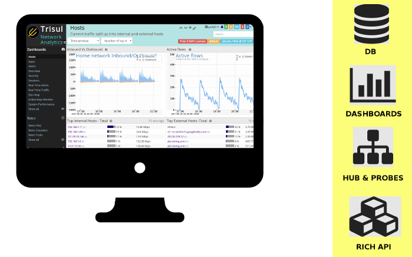

Trisul Network Analytics : Network Security Monitoring in a Docker 
===========

A full blown Network Security and Traffic Monitoring (NSM) solution you can deploy in 1 minute.

> New Jan 22 2018:  *NEW*  Trisul NSM docker images includes Cross-Drill allows you to track information flows. 

> Oct 12 2018: [trisul-probe](https://github.com/trisulnsm/docker/blob/master/trisul-probe/README.md)  docker image containing only the probe components. Use this to roll out probes, connecting to a Trisul-Hub node.  
> Mar 02 2018: --enable-file-extraction flag 
> Feb 22 2018:  Added tshark and snmp. With tshark "Quick PCAP" view will give you a one line summary per packet, without you having to download the full PCAP. SNMP tools can add interface or any other metrics using the SNMP Lua Script and to resolve Netflow interfaces and router names. 


Other links
-----------

[Docker Hub trisulnsm/trisul6](https://hub.docker.com/r/trisulnsm/trisul6/)  || 
[Trisul DevZone Docker articles](https://www.trisul.org/devzone/doku.php/articles) 


- Full traffic monitoring - 100s of metrics from every angle
- Alert on traffic, flows, malware activity
- Complete flow monitoring, record every flow with blazing fast retrieval
- Extract URLs, Certs, Files, .. with API to script your own
- Sophisticated PCAP storage with best retrieval times
- Includes a limited version of Trisul Edge, **streaming graph analytics** 
- Also includes Suricata + ET community rules with auto refresh 
- **BEST of all**  - all parts are included and optimized. No messing around with Splunk or ELK or SIEMS. 
- FREE to monitor a rolling window of the most recent 3 days. See [Trisul Licensing](https://www.trisul.org/free/)  for more options. 


Cast
---

1. [Trisul Network Analytics](https://trisul.org) for traffic analytics, flows, packet storage, resource, scripting, web interface.
2. Trisul Plugins : Geo , Badfellas (malware intel),  Urlfilter (web category) 
3. [Suricata IDS](https://suricata-ids.org/)  for IDS alerts : The output of Suricata is piped to Trisul using EVE JSON.
4. [Emerging Threats Open Rules](https://www.proofpoint.com/us)  for ruleset :  if you have an ET-PRO subscription, it is easy to plug that in.


 


Running.
---------

### 1. Install the free Docker if you havent already done so

Please see instructions for installing [Docker CE on Ubuntu 16.04](https://www.digitalocean.com/community/tutorials/how-to-install-and-use-docker-on-ubuntu-16-04) You can find official instructions for installing Docker on a number of platforms on the official [Install Docker site](https://docs.docker.com/engine/installation/)


### 2. Create data directory on host 

Create a directory on the host system where the data and config will be stored. This is a one time job.

````
sudo mkdir /opt/trisul6_root
````

### 3. Run TrisulNSM  on a capture interface 

Now you are ready to run TrisulNSM.  Say you want to capture traffic from the port `enp5s0`, just type 

````
sudo docker run  --net=host -v /opt/trisul6_root:/trisulroot -d trisulnsm/trisul6 --interface enp5s0 
````

In the above command, notice that you mapped the volume using `-v` of the host directory `/opt/trisul6_root` you created in step 1.  That is where all the persistent data is kept. 


**Thats it !**  Logon on `https://localhost:3000` and you can dive right in. See [Trisul Docs : Basic Usage](https://www.trisul.org/docs/ug/basicusage/index.html) to get started. 


### 4. Process a PCAP dump 

Trisul has a multi layered analytics capability. A first pass analysis with Trisul is done over a PCAP dump, then a second layer is created and another pass with Suricata IDS.  This gives you full NSM visibility of both traffic and signature based alerts .

````
sudo docker run --privileged=true  --name=trisul1a \
   --net=host -v /opt/trisul6_root:/trisulroot \
       -d trisulnsm/trisul6 --pcap myPacketDump.pcap

````

#### Notes on offline 

1. **PCAP File Location** The file `myPacketDump.pcap` has to be placed inside the shared volume `/opt/trisul6_root` volume so that the Docker image can see the outside file.
2. **privileged==true** This option is required because the Trisul File Extraction feature requires root to create a RAMFS partition inside the docker container  

---------------------

Additional tasks
================

Here are some tips for common use cases 


### Start TrisulNSM  docker without capturing

You can run the TrisulNSM docker , then log on the web interface setup the capture adapters, Netflow mode, or other options manually. To do that just skip the `--interface ` option

````
sudo docker run --net=host -v /opt/trisul6_root:/trisulroot -d trisulnsm/trisul6 
````


### Use different webserver ports 

By default TrisulNSM uses the `net:host` docker network and needs ports 3000 (for web access) and 3003 (for websockets) open. If you wish to change these ports use the `--webserver-port`  and `--websockets-port` options 

````
sudo docker run --net=host \
  -v /opt/trisul6_root:/trisulroot \
     -d trisulnsm/trisul6 \
       --interface enp5s0 --webserver-port 4000 --websockets-port 4003 
````


## Recommendation : assign a label to the docker instance


We recommend that you assign a name using `--name` to the running docker instance , so you can log in to it easily. To assign `trisul1a` to a new instance 

````
sudo docker run --name  trisul1a \
  --net=host -v /opt/trisul6_root:/trisulroot \
     -d trisulnsm/trisul6 \
       --interface enp5s0 --webserver-port 4000 --websockets-port 4003 
````

You can login to the docker using the usual -it switch 


````
sudo docker exec -it <tag> /bin/bash
````

Options
========

1. `--interface <value>`  :  which interface do you want to start a live capture on ?
2. `--pcap <file>` : run the instance over this pcap file. You need to place the pcap file inside the host volume. For example `/opt/trisul6_root` in the sample commands shown above. 
3.  `--no-ids` : Do not run a second IDS analysis pass over the PCAP file. This option must be used only with the `--pcap` option
4. `--webserver-port <port-number>` : Run the container webserver instance on this port. Default is 3000 
5. `--websockets-port <port-number>` : Use this port for websockets. This is needed for the real time features of Trisul. 
6. `--timezone <TZ>` : example `--timezone Asia/Kolkata` the names are the standard ones found in zoneinfo file 
7. `--fine-resolution`: All metrics are tracked with a 1 second resolution. Use for small PCAP files 
8. `--enable-file-extraction` : Enables file extraction feature for the "Save Binaries App". This option creates a TMPFS filesystem, hence to use this option please also use the `--privileged=true` docker option. 
9. `--context-name <context name>` : You may want to use this option with PCAP import, specifiy a context name instead of trying to compute one from the PCAP filename. 

Trust Error
-----

If you get the following error when you do a `docker pull` ;  try `export DOCKER_CONTENT_TRUST=0`

````
Error: remote trust data does not exist for docker.io/trisulnsm/trisul6: notary.docker.io does not have trust data for docker.io/trisulnsm/trisul6
````


Docker Options
==============
1. `--privileged=true` : Add this flag to enable file extraction. We need privileged access in order to create and mount a tmpfs partition needed for the file extraction feature.  


Developers
==========

## Building your own docker images from packages

1. Go to [Trisul.org Downloads](https://trisul.org/download)  and put the latest Xenial DEBs into the same directory as this repo
2. Run

````docker
docker build -t trisul-full .

# To tag and push to docker hub 
docker images
docker tag   5506cc84148b trisulnsm/trisul6:latest
docker login
docker push trisulnsm/trisul6:latest

````


